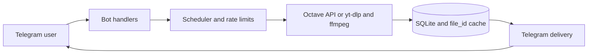

<p align="center">
  
</p>

<h1 align="center">e6akl4k music downloader bot</h1>

<p align="center">
  A self-hosted Telegram bot for finding, converting, and downloading music from Octave Streaming and sources supported by <code>yt-dlp</code>.
</p>

<p align="center">
  <a href="https://gitlab.com/d6xd/e6akl4k/-/pipelines"></a>
  <a href="https://gitlab.com/d6xd/e6akl4k/-/releases"></a>
  <a href="https://go.dev/"></a>
  <a href="https://www.docker.com/"></a>
  <a href="LICENSE"></a>
</p>

## Contents

- [Русская версия](README.ru.md)
- [Features](#features)
- [Quick start](#quick-start)
- [How it works](#how-it-works)
- [Supported media](#supported-media)
- [Documentation](#documentation)
- [License](#license)

## Features

- Search YouTube for title and inline queries, marking exact, similar, and alternate-version results.
- Download tracks and albums directly from Octave Streaming in MP3 128/320 or lossless FLAC.
- Let Telegram fetch eligible Octave MP3 URLs directly, with a circuit breaker, resumable local fallback, and per-stage latency logs.
- Download from YouTube, SoundCloud, Bandcamp, VK, Mixcloud, Audiomack, and other sources supported by `yt-dlp`.
- Use Spotify, Apple Music, Deezer, Tidal, and Yandex Music links to find matching YouTube versions with explicit user confirmation.
- Export MP3, FLAC, M4A, and OGG; Telegram receives title and performer fields, while converted files retain embedded metadata and cover art.
- Download complete playlists through a bounded download/upload pipeline, reuse one album cover, and split large ZIP archives automatically.
- Reuse Telegram `file_id` values through a persistent SQLite cache and coalesce identical concurrent requests.
- Run up to seven downloads concurrently with rate limiting and one heavy task per user.
- Monitor the bot through health checks, Prometheus metrics, `/perf`, redacted `/log` traces, bans, dynamic administrators, and an audit log.
- Show a once-daily support note after a successful download, with a permanent one-tap opt-out.
- Remember a default format and quality per user through `/settings`, so regular users skip the format keyboard while keeping playlist range and delivery choices.
- Re-deliver recent tracks through `/history`: the last ten downloads come back instantly from the Telegram cache without a new download, and the list can be cleared with one tap.
- Search by a forwarded audio file in private chat: its performer and title tags (or the file name) become the query, and the duration helps rank the results.

The project is designed for small private installations: a personal bot shared with friends, with enough safety and observability to run unattended on a VPS.

## Quick start

On a fresh Debian or Ubuntu server:

```bash
git clone https://gitlab.com/d6xd/e6akl4k.git
cd e6akl4k
chmod +x bootstrap.sh deploy.sh rollback.sh
./bootstrap.sh
./deploy.sh
```

`bootstrap.sh` performs one-time host and SSH setup. The lean `deploy.sh` preserves secrets, backs up SQLite, deploys a versioned image, verifies health, and rolls back automatically. Pass an immutable Registry tag as its optional argument; `rollback.sh` restores the saved previous image.

For YouTube cookies, local development, updates, and rollback behavior, see the [deployment guide](docs/deployment.md).

## How it works



Incoming Telegram updates are persisted before processing. Downloads, quick lookups, and ZIP creation use separate concurrency limits. Cached tracks are delivered through Telegram without contacting Octave or rerunning `yt-dlp` and `ffmpeg`.

## Supported media

| Category | Support |
| --- | --- |
| Direct sources | Octave Streaming, YouTube, YouTube Music, SoundCloud, Bandcamp, VK, Mixcloud, Audiomack, and other `yt-dlp` extractors |
| Metadata links | Spotify, Apple Music, Deezer, Tidal, and Yandex Music |
| Audio formats | MP3 128/320/VBR, FLAC, M4A, and OGG Vorbis |
| Playlists | Complete playlist, first 10/25/75 tracks, or ranges of ten tracks |
| Telegram delivery | Audio albums, documents, split ZIP archives, and cached `file_id` delivery |
| Telegram ID lookup | `/id` for your ID, or `/id @username` for a user previously seen by the bot |

Metadata-only services are never presented as direct audio sources. The bot searches YouTube and asks the user to confirm the selected version.

## Documentation

- [Deployment and updates](docs/deployment.md)
- [Configuration reference](docs/configuration.md)
- [Architecture and project structure](docs/architecture.md)
- [Changelog](CHANGELOG.md)
- [Russian README](README.ru.md)

## License

The source code is distributed under the [MIT License](LICENSE). The project logo is available under CC0 1.0; see the [asset credits](assets/README.md).
