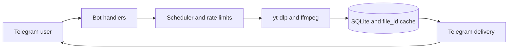

<p align="center">
  
</p>

<h1 align="center">e6akl4k music downloader bot</h1>

<p align="center">
  A self-hosted Telegram bot for finding, converting, and downloading music with <code>yt-dlp</code>.
</p>

<p align="center">
  <a href="https://github.com/d6xd/e6akl4k/actions/workflows/ci.yml"></a>
  <a href="https://github.com/d6xd/e6akl4k/releases"></a>
  <a href="https://go.dev/"></a>
  <a href="https://www.docker.com/"></a>
  <a href="LICENSE"></a>
</p>

## Contents

- [Русская версия](README.ru.md)
- [Features](#features)
- [Quick start](#quick-start)
- [How it works](#how-it-works)
- [Supported media](#supported-media)
- [Documentation](#documentation)
- [License](#license)

## Features

- Search by title in a private chat or inline with `@bot track name` from any chat.
- Download from YouTube, SoundCloud, Bandcamp, VK, Mixcloud, Audiomack, and other sources supported by `yt-dlp`.
- Use Spotify, Apple Music, Deezer, Tidal, and Yandex Music links to find matching YouTube versions with explicit user confirmation.
- Export MP3, FLAC, M4A, and OGG with metadata and cover art.
- Download complete playlists or selected ranges, send audio albums, and split large ZIP archives automatically.
- Reuse Telegram `file_id` values through a persistent SQLite cache and coalesce identical concurrent requests.
- Run up to seven downloads concurrently with rate limiting and one heavy task per user.
- Monitor the bot through health checks, Prometheus metrics, JSON logs, and administrative commands.

The project is designed for small private installations: a personal bot shared with friends, with enough safety and observability to run unattended on a VPS.

## Quick start

On a fresh Debian or Ubuntu server:

```bash
git clone https://github.com/d6xd/e6akl4k.git
cd e6akl4k
chmod +x deploy.sh
./deploy.sh
```

The deployment script installs Docker and Compose, asks for the Telegram bot token, builds the container, creates backups on updates, and waits for a successful health check.

For YouTube cookies, local development, updates, and rollback behavior, see the [deployment guide](docs/deployment.md).

## How it works



Incoming Telegram updates are persisted before processing. Downloads, quick lookups, and ZIP creation use separate concurrency limits. Cached tracks are delivered through Telegram without rerunning `yt-dlp` or `ffmpeg`.

## Supported media

| Category | Support |
| --- | --- |
| Direct sources | YouTube, YouTube Music, SoundCloud, Bandcamp, VK, Mixcloud, Audiomack, and other `yt-dlp` extractors |
| Metadata links | Spotify, Apple Music, Deezer, Tidal, and Yandex Music |
| Audio formats | MP3 128/320/VBR, FLAC, M4A, and OGG Vorbis |
| Playlists | Complete playlist, first 10/25/75 tracks, or ranges of ten tracks |
| Telegram delivery | Audio albums, documents, split ZIP archives, and cached `file_id` delivery |

Metadata-only services are never presented as direct audio sources. The bot searches YouTube for possible matches and asks the user to confirm the selected version.

## Documentation

- [Deployment and updates](docs/deployment.md)
- [Configuration reference](docs/configuration.md)
- [Architecture and project structure](docs/architecture.md)
- [Changelog](CHANGELOG.md)
- [Russian README](README.ru.md)

## License

Distributed under the [MIT License](LICENSE).
