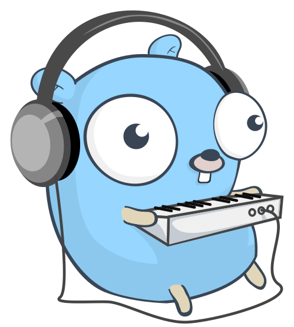

<p align="center">
  
</p>

<h1 align="center">e6akl4k music downloader bot</h1>

> [English version](README.md)

Telegram-бот на Go для поиска и скачивания музыки из Octave Streaming и источников `yt-dlp`.

## Возможности

- Прямое скачивание треков и альбомов Octave Streaming в MP3 128/320 или lossless FLAC.
- Быстрая передача подходящих MP3 напрямую из Octave в Telegram с circuit breaker, автоматическим локальным fallback, повторными попытками и докачкой через HTTP Range.
- YouTube / YouTube Music, SoundCloud, Bandcamp, VK, Mixcloud, Audiomack и другие поддерживаемые `yt-dlp` источники.
- MP3 128/320/VBR, FLAC, M4A и OGG Vorbis; Telegram получает название и исполнителя, а конвертируемые файлы — встроенные метаданные и обложки.
- Ранжированный поиск по YouTube; результаты помечаются как точные, похожие или другая версия.
- Предпросмотр названия, исполнителя, длительности, числа треков и примерного размера.
- Spotify, Apple Music, Deezer, Tidal и Яндекс Музыка используются как ссылки на метаданные: бот предлагает подходящие версии с YouTube и просит подтвердить совпадение.
- Плейлисты целиком, первыми 10/25/75 треками или диапазонами по десять.
- MP3/M4A отправляются аудиоальбомами до десяти файлов; FLAC/OGG — документами. ZIP автоматически разбивается примерно по 45 МБ.
- Русский и английский интерфейс, этапы обработки, фактический прогресс отправки в Telegram, ETA и отмена загрузки.
- Постоянный SQLite-кэш Telegram `file_id`: повторный запрос не запускает `yt-dlp` и `ffmpeg`.
- Объединение одинаковых одновременных запросов в одну загрузку.
- До семи одновременных загрузок без очереди ожидания, отдельные FIFO-очереди поиска и архивации, rate limit и одна тяжёлая задача на пользователя.
- Входящие Telegram updates сохраняются в SQLite до обработки и восстанавливаются после рестарта.
- Healthcheck, Prometheus-метрики, JSON-логи, `/perf`, безопасный `/log [fresh] <ссылка>`, баны, динамические администраторы и аудит.
- Ненавязчивое сообщение поддержки после успешной загрузки — не чаще раза в сутки, с постоянным отключением одной кнопкой.
- Формат и качество по умолчанию для каждого пользователя через `/settings`: постоянные пользователи не выбирают формат каждый раз, а выбор диапазона и способа доставки плейлиста сохраняется.
- Повторная отправка недавних треков через `/history`: последние десять загрузок приходят мгновенно из кэша Telegram без новой загрузки, а список очищается одной кнопкой.
- Несколько ссылок на треки в одном сообщении (до пяти) скачиваются вместе: один формат на все, последовательная обработка в одном слоте и отчёт по каждой неудачной ссылке вместо отмены всего пакета.

Музыкальные сервисы вроде Spotify не используются как источник аудиофайла. Бот читает их публичные метаданные, ищет варианты на YouTube и показывает выбор пользователю. Это не маскирует приблизительное совпадение под оригинал.

## Состав

```text
runtime.go          startup, polling и graceful shutdown
config.go           типизированная конфигурация окружения
main.go             Telegram-обработчики и отправка файлов
workflows.go        предпросмотр, поиск, диапазоны и общий кэш
resolver.go         безопасное чтение oEmbed/Open Graph ссылок
store.go            SQLite: языки, кэш, счётчики и история
scheduler.go        очереди, rate limit и дедупликация
app_state.go        одноразовые действия и активные задачи
bot_ui.go           клавиатуры, URL-валидация и форматирование
inline.go           inline-состояния и placeholder
inline_handlers.go  inline-поиск, загрузка и замена аудио
downloader.go       yt-dlp, метаданные, диапазоны и файлы
octave.go            API, модели, ссылки и playback-токены Octave
octave_downloader.go прямое скачивание и конвертация Octave
archive.go          ZIP-архивы
health.go           /healthz, /metrics и контроль диска
locales.go          русские и английские тексты
bootstrap.sh        однократная подготовка Debian/Ubuntu и SSH
deploy.sh           версионированный деплой, backup и healthcheck
rollback.sh         возврат на предыдущий Docker-образ
Dockerfile          multi-stage образ Go + yt-dlp + ffmpeg + Deno
docker-compose.yml  постоянный ограниченный контейнер
```

`yt-dlp`, `ffmpeg` и Deno остаются внешними инструментами. Telegram-flow, очереди, постоянное состояние, кэш и архивы реализованы на Go.

## Inline-режим и cache-канал

1. Создай закрытый Telegram-канал.
2. Добавь бота администратором с правом публиковать сообщения.
3. Запиши числовой ID канала:

```env
CACHE_CHAT_ID=-1001234567890
```

Старое имя `INLINE_CACHE_CHAT_ID` тоже поддерживается.

4. В `@BotFather` выполни `/setinline`, выбери бота и задай placeholder, например `Найти музыку`.
5. Выполни `/setinlinefeedback` и установи `100`, чтобы бот получал каждый выбранный результат.
6. Перезапусти бота и напиши `@username название песни`.

На первом запуске бот создаст секундный беззвучный MP3 и загрузит его в cache-канал. Полученный `file_id` можно явно задать через `INLINE_PLACEHOLDER_FILE_ID`.

Готовые треки хранятся в SQLite (`$XDG_DATA_HOME/musicbot.db`, в Docker — `/app/cache/musicbot.db`). Старый `inline-audio-cache.json` автоматически импортируется и переименовывается в `.migrated`. Inline скачивает MP3 320 kbps; плейлисты обрабатываются в личном чате.

Cache-канал позволяет получить `file_id` до ответа первому пользователю. Без него общий кэш всё равно запомнит `file_id`, полученный при первой обычной отправке.

## Очереди и кэш

По умолчанию одновременно работают до семи загрузок. Ожидающей очереди для них нет: восьмой одновременный запрос получит ответ «бот занят». Два быстрых lookup-запроса и одна ZIP-архивация по-прежнему имеют отдельные FIFO-очереди. Частота новых ссылок и поисков ограничена 12 запросами в минуту.

```env
DATABASE_PATH=/app/cache/musicbot.db
CACHE_TTL=4320h
DOWNLOAD_WORKERS=7
DOWNLOAD_QUEUE_SIZE=0
YTDLP_SLEEP_REQUESTS=0
YTDLP_CONCURRENT_FRAGMENTS=4
LOOKUP_WORKERS=2
LOOKUP_QUEUE_SIZE=40
ARCHIVE_WORKERS=1
ARCHIVE_QUEUE_SIZE=10
UPDATE_WORKERS=32
UPDATE_QUEUE_SIZE=256
RATE_LIMIT=12
INLINE_RATE_LIMIT=60
RATE_WINDOW=1m
MAX_PLAYLIST_TRACKS=75
DROP_PENDING_UPDATES=false
```

Каждая операция `yt-dlp`, включая загрузку, предпросмотр и поиск, использует изолированную временную копию `cookies.txt`. Исходный файл монтируется в контейнер только для чтения, поэтому параллельные запуски не повредят cookies.

## Быстрый деплой

На новом Debian/Ubuntu-сервере:

```bash
chmod +x bootstrap.sh deploy.sh rollback.sh
./bootstrap.sh
./deploy.sh
```

`bootstrap.sh` один раз устанавливает Docker/Compose, создаёт секреты и каталоги и безопасно настраивает SSH при наличии ключа. `deploy.sh` больше не устанавливает пакеты и не изменяет `.env`/cookies: он делает backup SQLite, запускает конкретный тег образа, ждёт healthcheck и автоматически возвращает предыдущую версию при ошибке.

Для автоматизированного запуска заранее создай `.env` через менеджер секретов:

```bash
COOKIES_FILE='/tmp/cookies.txt' BOT_TOKEN='123456:...' ./bootstrap.sh
```

Для локальной сборки запусти `./deploy.sh`. Для неизменяемого образа из Registry передай точный тег: `./deploy.sh registry.gitlab.com/group/project:<git-sha>`. Ручной откат выполняется через `./rollback.sh`.

```bash
sudo docker compose logs -f
sudo docker compose restart
sudo docker compose down
```

Dockerfile фиксирует версии `yt-dlp` и Deno build args, проверяет опубликованные SHA-256 и запускает `--version` как smoke-test. Для осознанного обновления измени `YTDLP_VERSION`/`DENO_VERSION`, затем:

```bash
sudo docker compose build --no-cache --pull
sudo docker compose up -d
```

## Cookies YouTube

На VPS YouTube часто отвечает `Sign in to confirm you're not a bot`. Экспортируй cookies залогиненного аккаунта в формате Netscape:

```bash
COOKIES_FILE="$HOME/cookies.txt" BOT_TOKEN='123456:...' ./bootstrap.sh
```

Файл монтируется только для чтения, а `yt-dlp` работает с его изолированными временными копиями. Права устанавливаются в `0600`. При повторном bot-check экспортируй свежий файл и снова запусти deploy.

## Ручной запуск

Требования: Go 1.26+, свежие `yt-dlp`, `ffmpeg` и Deno в `PATH`.

```bash
cp .env.example .env
# укажи BOT_TOKEN и выставь chmod 600 .env
go build -o musicbot .
./musicbot
```

Бот читает `.env` из рабочей директории; переменные процесса имеют приоритет. `cookies.txt` по умолчанию ищется рядом, другой путь задаётся `YTDLP_COOKIES_FILE`. Полный перечень настроек находится в `.env.example`.

## Наблюдаемость и администрирование

HTTP-сервер слушает `127.0.0.1:8080` при нативном запуске и `0.0.0.0:8080` внутри контейнера:

```text
GET /healthz   состояние SQLite, yt-dlp, диска и очередей в JSON
GET /metrics   метрики Prometheus
```

Compose не публикует порт наружу. Для внешнего Prometheus добавь защищённый reverse proxy или локальную привязку порта.

```env
ADMIN_IDS=123456789,987654321
DISK_WARNING_BYTES=536870912
DISK_CHECK_INTERVAL=10m
LOG_FORMAT=json
```

`ADMIN_IDS` задаёт неудаляемых владельцев. Владельцы управляют динамическими администраторами через `/addadmin` и `/deladmin`. Администраторам доступны `/ban`, `/pardon`, `/admins`, `/banlist`, `/userinfo`, `/jobs`, `/adminlog`, `/stats`, `/status`, `/perf [1h|24h|7d]` и `/log [fresh] <ссылка>`. Диагностический лог маскирует playback-токены, cookies и авторизацию.

`/id` показывает ID отправителя, а `/id @username` — ID пользователя, которого бот уже видел в доступных ему Telegram updates. Bot API не позволяет искать произвольных людей по username, поэтому незнакомый боту пользователь должен сначала написать ему или появиться в доступном чате.

## Ограничения

- Официальный Telegram Bot API принимает загружаемые ботом файлы до 50 МБ. В музыкальном плеере поддерживаются MP3 и M4A; FLAC и OGG отправляются документами.
- Порог длительности зависит от формата и заранее отбрасывает заведомо слишком большие треки.
- ZIP автоматически разбивается на части; одиночный файл всё равно должен помещаться в лимит Telegram.
- За один запрос скачивается не более настраиваемого лимита. При отправке большого плейлиста отдельными файлами бот обрабатывает его партиями и очищает диск после каждой партии.
- Язык, кэш, статистика и 90-дневная история загрузок хранятся в SQLite. Одноразовые кнопки и временные файлы намеренно не восстанавливаются после рестарта.
- Telegram `file_id` принадлежит конкретному боту и не переносится при смене токена.

## Проверка

```bash
go test ./...
go test -race ./...
go vet ./...
docker compose config --quiet
```

CI также собирает бинарник и Docker-образ. Тесты покрывают SQLite, TTL кэша, очереди, rate limit, дедупликацию, диапазоны плейлистов, ZIP-разбиение, resolver и повторную отправку через Telegram `file_id`.

## Лицензия

Исходный код распространяется по [лицензии MIT](LICENSE). Логотип проекта доступен по CC0 1.0; подробности указаны в [описании ассетов](assets/README.md).
