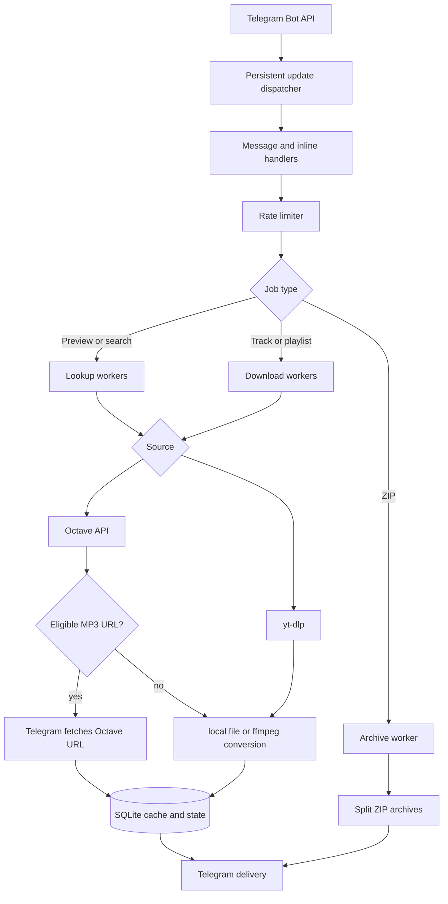

# Architecture

## Request flow

Incoming Telegram updates are committed to SQLite before dispatch and removed after successful handling. This allows unprocessed updates to survive a restart.

Heavy downloads, quick lookups, archive creation, and Telegram update handling have independent concurrency controls. Identical concurrent requests are coalesced into a single download, while a per-user guard prevents one user from starting multiple heavy jobs.

## Project structure

| File | Responsibility |
| --- | --- |
| `runtime.go` | Startup, polling, configuration loading, and graceful shutdown. |
| `config.go` | Typed and validated environment configuration. |
| `main.go` | Telegram handlers and file delivery. |
| `workflows.go` | Previews, searches, playlist ranges, and shared caching. |
| `resolver.go` | Safe oEmbed and Open Graph link resolution. |
| `store.go` | SQLite languages, observed Telegram users, cache, roles, bans, audit, samples, updates, and history. |
| `admin.go` | Owner/admin authorization, moderation commands, `/perf`, and audit views. |
| `download_trace.go` | Redacted administrator download diagnostics. |
| `media_metrics.go` | Bounded stage-sample recorder and performance aggregation. |
| `upload_progress.go` | Throttled status and multipart upload progress. |
| `support_notice.go` | Throttled post-download support message and persistent opt-out. |
| `circuit_breaker.go` | Octave remote-URL circuit state machine. |
| `search_rank.go` | Search normalization, confidence scoring, and version penalties. |
| `scheduler.go` | Queues, rate limits, and request deduplication. |
| `app_state.go` | One-time actions and active jobs. |
| `bot_ui.go` | Keyboards, URL validation, and formatting. |
| `inline.go` | Inline state and placeholder audio. |
| `inline_handlers.go` | Inline search, download, and audio replacement. |
| `downloader.go` | `yt-dlp`, metadata, playlist ranges, and output files. |
| `octave.go` | Octave API models, strict URL parsing, direct metadata, and playback-token caching. |
| `octave_downloader.go` | Direct Octave downloads, album ranges, conversion, and bounded media reads. |
| `archive.go` | ZIP creation and splitting. |
| `health.go` | `/healthz`, `/metrics`, and disk monitoring. |
| `locales.go` | Russian and English interface copy. |
| `bootstrap.sh` | One-time Docker, secret-directory, and safe SSH setup. |
| `deploy.sh`, `rollback.sh` | Versioned deployment, SQLite backup, health verification, and rollback. |

Text and inline searches use YouTube through `yt-dlp`. Direct Octave links use its HTTP API for metadata and media downloads. For an eligible single MP3 128/320 below the conservative remote-file limit, Telegram fetches the short-lived Octave URL into the private cache channel and the bot stores the returned `file_id`. Repeated definitive failures open a circuit and immediately select the local path; a half-open probe restores the fast path. Local media uses bounded `.part` files, token refresh, validated HTTP Range resume, and safe restart when a server ignores Range. Native Octave MP3 files use passthrough preparation; `ffmpeg` remains responsible for formats that require conversion.

Each media stage emits a structured `media_stage` log and a secret-free bounded SQLite sample. `/perf` aggregates success rate, P50/P95, and throughput. `/log` runs one real MP3 320 workflow and returns a redacted trace. Multipart readers report throttled byte progress without unbounded Telegram edits.

## Cache behavior

The primary cache stores Telegram `file_id` values in SQLite. A repeated request can therefore be delivered through Telegram without downloading or converting the track again. Cache entries expire after `CACHE_TTL`, which defaults to 180 days.

An optional private cache channel lets inline mode obtain a reusable `file_id` before answering the first user. Without that channel, regular deliveries are still cached after their first successful send.

Every `yt-dlp` process receives an isolated temporary copy of `cookies.txt`. The source file remains read-only inside the container.

Octave playback tokens are cached only in memory until shortly before their server-provided expiry. Persistent cache keys contain the stable Octave track ID, never the temporary tokenized audio URL.

## Delivery constraints

- The official Telegram Bot API accepts bot uploads up to 50 MiB.
- Telegram's music player supports MP3 and M4A; FLAC and OGG are sent as documents.
- ZIP archives are split automatically, but every individual file must still fit within Telegram's limit.
- Large individual playlists use a two-stage producer/consumer pipeline: the next batch downloads while the current batch uploads, with at most two batches on disk.
- Telegram `file_id` values belong to one bot and cannot be transferred to a different bot token.
