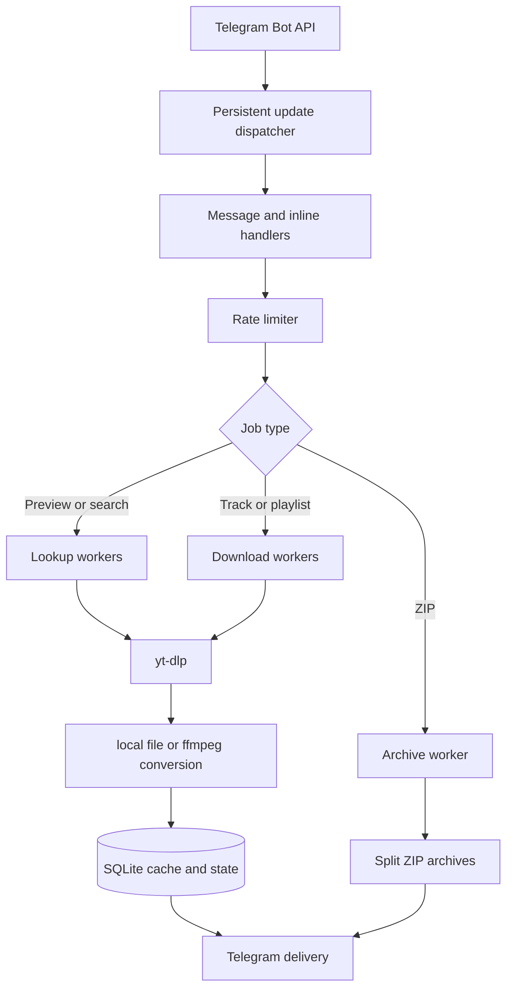

# Architecture

## Request flow

Incoming Telegram updates are committed to SQLite before dispatch and removed after successful handling. This allows unprocessed updates to survive a restart.

Heavy downloads, quick lookups, archive creation, and Telegram update handling have independent concurrency controls. Identical concurrent requests are coalesced into a single download, while a per-user guard prevents one user from starting multiple heavy jobs.

## Project structure

| File | Responsibility |
| --- | --- |
| `runtime.go` | Startup, polling, configuration loading, and graceful shutdown. |
| `config.go` | Typed and validated environment configuration. |
| `main.go` | Telegram handlers and file delivery. |
| `workflows.go` | Previews, searches, playlist ranges, and shared caching. |
| `resolver.go` | Safe oEmbed and Open Graph link resolution. |
| `store.go` | SQLite languages, observed Telegram users, cache, roles, bans, audit, samples, updates, and history. |
| `admin.go` | Owner/admin authorization, moderation commands, `/perf`, and audit views. |
| `download_trace.go` | Redacted administrator download diagnostics. |
| `error_report.go` | Deduplicated, redacted forwarding of user-facing errors to the cache or error chat, with report IDs, expected/real classification, and spike alerts. |
| `error_report_store.go` | SQLite storage of error reports for the buttons, the digest, and the status message. |
| `error_report_actions.go` | Administrator buttons under a report: retry, fixed-and-notify, and a developer copy. |
| `error_digest.go` | Silent periodic digest of expected errors. |
| `status_monitor.go` | Pinned status message, component health checks, failure and recovery alerts, and the scheduled cookie login check. |
| `buildinfo.go` | Bot commit stamped by `git archive` and the cached `yt-dlp` version. |
| `export.go` | `/export` and preview-button tracklists as "Artist - Title" lines or a `.txt` file. |
| `export_sources.go` | Deezer and Yandex Music public API tracklists and single tracks of other streaming services. |
| `cover.go` | `/cover` artwork from music APIs (largest CDN rendition first) or `yt-dlp` thumbnails, with square selection and lossless PNG Topic cropping; sent as a document to keep full quality. |
| `lastfm.go` | `/lastfm` profile linking, recent, loved and top track lists from the last.fm API, and a YouTube search for a picked track. |
| `notify.go` | Admin-only `/msgall` broadcasts with preview and confirmation, `/msg <tg_id>` direct notices, and the per-user `/notify` mute switch. |
| `media_metrics.go` | Bounded stage-sample recorder and performance aggregation. |
| `upload_progress.go` | Throttled status and multipart upload progress. |
| `support_notice.go` | Throttled post-download support message and persistent opt-out. |
| `search_rank.go` | Search normalization, confidence scoring, and version penalties. |
| `scheduler.go` | Queues, rate limits, and request deduplication. |
| `app_state.go` | One-time actions and active jobs. |
| `bot_ui.go` | Keyboards, URL validation, and formatting. |
| `inline.go` | Inline state, result text, and YouTube link parsing. |
| `inline_handlers.go` | Inline answers, downloads, and editing the sent message into audio. |
| `downloader.go` | `yt-dlp`, metadata, playlist ranges, and output files. |
| `archive.go` | ZIP creation and splitting. |
| `health.go` | `/healthz`, `/metrics`, and disk monitoring. |
| `locales.go` | Russian and English interface copy. |
| `bootstrap.sh` | One-time Docker, secret-directory, and safe SSH setup. |
| `deploy.sh`, `rollback.sh` | Versioned deployment, SQLite backup, health verification, and rollback. |

All searches and downloads go through `yt-dlp`. Private text searches and inline searches query YouTube; links to Spotify, Apple Music, Deezer, Tidal, and Yandex Music tracks are resolved to a title and then searched on YouTube. Playlist, album, and artist links of these services are never searched as one track: a Deezer or Yandex Music tracklist is shown with the tracklist and cover buttons, other collections get a hint to send single tracks. A service that answers HTTP 451 from the server's country (Yandex Music outside the CIS) and a link that opens the service home page are explained instead of searching the page title; `YANDEX_PROXY` routes only Yandex Music site and API requests through a proxy with a CIS exit. Downloads write bounded `.part` files and resume interrupted transfers. Native MP3 files use passthrough preparation; `ffmpeg` remains responsible for formats that require conversion.

Each media stage emits a structured `media_stage` log and a secret-free bounded SQLite sample. `/perf` aggregates success rate, P50/P95, and throughput. `/log` runs one real MP3 320 workflow and returns a redacted trace. Multipart readers report throttled byte progress without unbounded Telegram edits.

## Cache behavior

The primary cache stores Telegram `file_id` values in SQLite. A repeated request can therefore be delivered through Telegram without downloading or converting the track again. Cache entries expire after `CACHE_TTL`, which defaults to 180 days.

An optional private cache channel lets inline mode obtain a reusable `file_id` before answering the first user. Without that channel, regular deliveries are still cached after their first successful send.

Every `yt-dlp` process receives an isolated temporary copy of `cookies.txt`. The source file remains read-only inside the container.

## Delivery constraints

- The official Telegram Bot API accepts bot uploads up to 50 MiB; an optional local Bot API server raises the limit to 2000 MiB. A track over the limit gets buttons with lighter formats that fit instead of an error.
- Telegram's music player supports MP3 and M4A; FLAC and OGG are sent as documents.
- ZIP archives are split automatically, but every individual file must still fit within Telegram's limit.
- Large playlists use a two-stage producer/consumer pipeline: the next batch (10 tracks for individual files, 50 for ZIP archives) downloads while the current batch uploads, with at most two batches on disk. Every batch waits for a download slot of its own, so a long playlist does not hold a worker for hours.
- Telegram `file_id` values belong to one bot and cannot be transferred to a different bot token.
