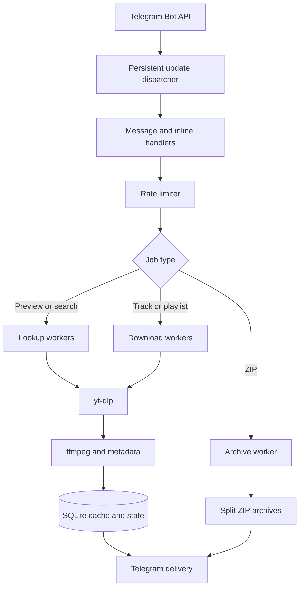

# Architecture

## Request flow

Incoming Telegram updates are committed to SQLite before dispatch and removed after successful handling. This allows unprocessed updates to survive a restart.

Heavy downloads, quick lookups, archive creation, and Telegram update handling have independent concurrency controls. Identical concurrent requests are coalesced into a single download, while a per-user guard prevents one user from starting multiple heavy jobs.

## Project structure

| File | Responsibility |
| --- | --- |
| `runtime.go` | Startup, polling, configuration loading, and graceful shutdown. |
| `config.go` | Typed and validated environment configuration. |
| `main.go` | Telegram handlers and file delivery. |
| `workflows.go` | Previews, searches, playlist ranges, and shared caching. |
| `resolver.go` | Safe oEmbed and Open Graph link resolution. |
| `store.go` | SQLite languages, cache, counters, updates, and history. |
| `scheduler.go` | Queues, rate limits, and request deduplication. |
| `app_state.go` | One-time actions and active jobs. |
| `bot_ui.go` | Keyboards, URL validation, and formatting. |
| `inline.go` | Inline state and placeholder audio. |
| `inline_handlers.go` | Inline search, download, and audio replacement. |
| `downloader.go` | `yt-dlp`, metadata, playlist ranges, and output files. |
| `archive.go` | ZIP creation and splitting. |
| `health.go` | `/healthz`, `/metrics`, and disk monitoring. |
| `locales.go` | Russian and English interface copy. |
| `deploy.sh` | Initial deployment, updates, backups, and rollback. |

`yt-dlp`, `ffmpeg`, and Deno remain external tools. Telegram interaction, scheduling, persistent state, caching, and archive handling are implemented in Go.

## Cache behavior

The primary cache stores Telegram `file_id` values in SQLite. A repeated request can therefore be delivered through Telegram without downloading or converting the track again. Cache entries expire after `CACHE_TTL`, which defaults to 180 days.

An optional private cache channel lets inline mode obtain a reusable `file_id` before answering the first user. Without that channel, regular deliveries are still cached after their first successful send.

Every `yt-dlp` process receives an isolated temporary copy of `cookies.txt`. The source file remains read-only inside the container.

## Delivery constraints

- The official Telegram Bot API accepts bot uploads up to 50 MiB.
- Telegram's music player supports MP3 and M4A; FLAC and OGG are sent as documents.
- ZIP archives are split automatically, but every individual file must still fit within Telegram's limit.
- Large playlists are processed in batches and temporary disk data is removed after each batch.
- Telegram `file_id` values belong to one bot and cannot be transferred to a different bot token.
